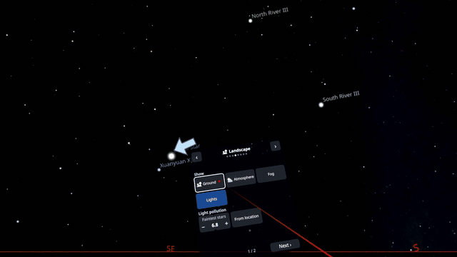
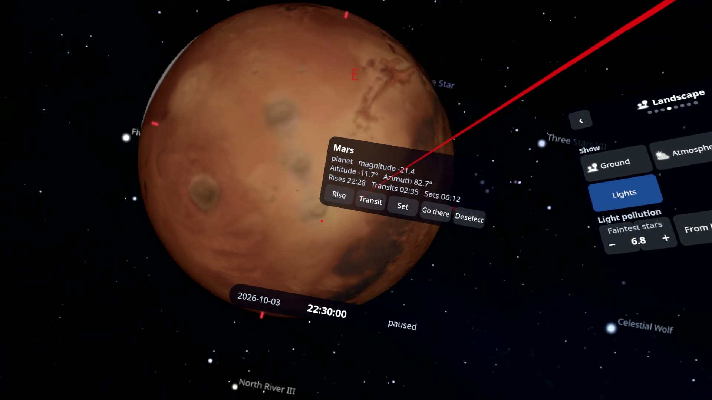
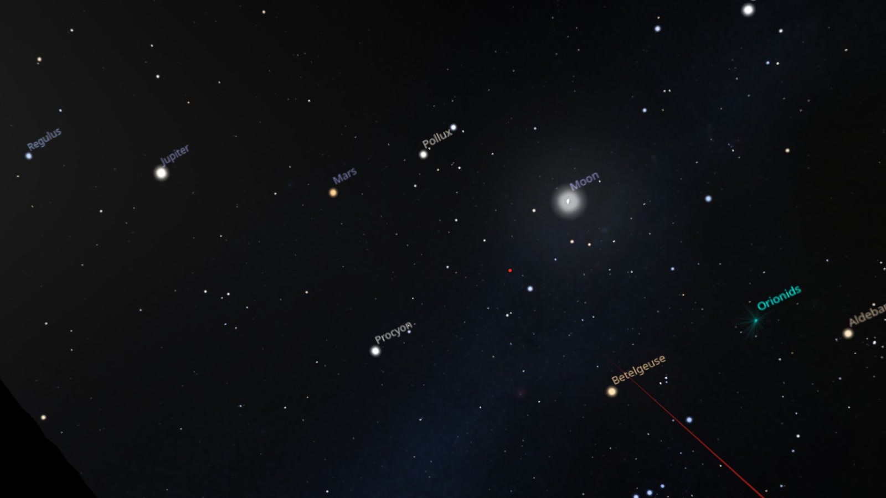
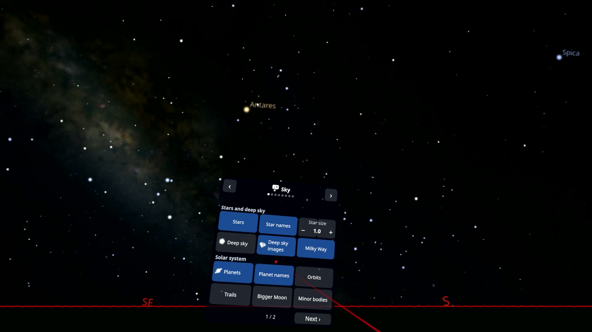
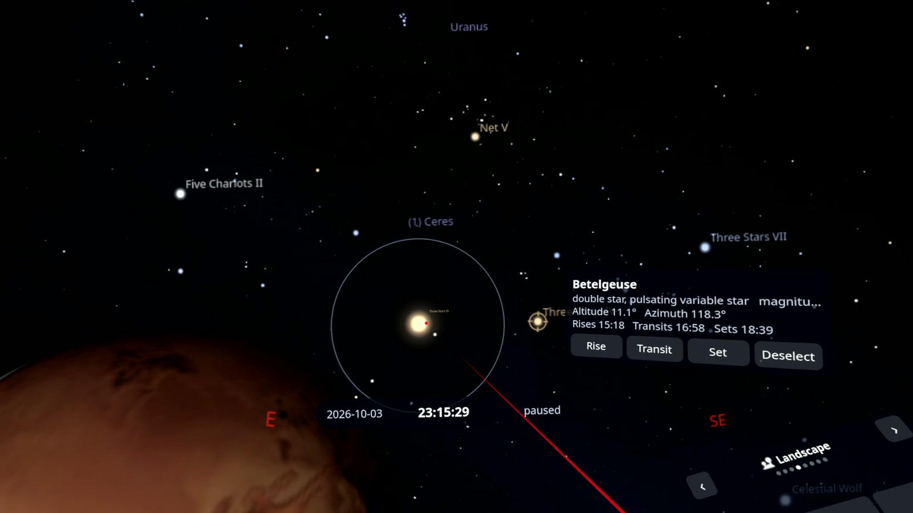

# Stellarium VR for the Steam Frame

Stand under the real night sky in your headset. This is [Stellarium](https://stellarium.org),
the free planetarium, made to run in VR on the Steam Frame: look around and the sky follows
your head, point at a star or planet to see what it is, zoom in on it with a loupe, and move
time forward or back to watch the sky turn. It runs standalone on the Frame itself; no PC needed.

[Watch the 80-second showcase](https://github.com/fresh-morning/stellarium-vr/releases/download/v0.1.0/showcase.mp4)

| | | |
|---|---|---|
|  |  |  |

## Download

Download the latest release:

**https://github.com/fresh-morning/stellarium-vr/releases/latest/download/Stellarium-aarch64.AppImage**

It is a single file, an AppImage, of about 466 MB. There is nothing to unpack or install
besides it.

## Install and run on the Steam Frame

Everything below is done in the headset, with the controllers.

1. Press the **+** button on the bar at the bottom of your view. Under **Launch Program**,
   pick **Mozilla Firefox**.
2. In Firefox, open the download link above (or the
   [release page](https://github.com/fresh-morning/stellarium-vr/releases/latest) and click
   `Stellarium-aarch64.AppImage` under **Assets**). Wait until the download says
   **Completed**; it takes a few minutes.
3. From the same **Launch Program** menu, open **Dolphin** (the file manager) and go to
   **Downloads**.
4. Make the file runnable: point at `Stellarium-aarch64.AppImage` and **click the right
   thumbstick** (that is a right-click), choose **Properties**, go to the **Permissions**
   tab, tick **Allow executing file as program**, and close the dialog with **OK**.
5. Click the right thumbstick on the file again and choose **Add to Steam**.
6. In your Steam **Library**, open the **Non-Steam** tab. Stellarium shows up there as
   **Stellarium-aarch64.AppImage**. Select it and press **Play**.
7. You see the Stellarium splash screen for a few seconds, then the sky around you.

To quit, go back to its page in the Steam Library, press the **X** next to **Resume**,
and **Confirm**.

## Controls

Point a controller at the sky or at a menu; the beam shows where you point.
Either controller's **trigger** clicks.

**Right controller**

| Button | What it does |
|---|---|
| Trigger | Pick the star or planet you point at (a card about it appears beside it); click menu buttons |
| Stick left / right | Scrub time backward / forward |
| Stick up / down | With the loupe open: narrow / widen the loupe's view |
| A | Pause time / back to normal speed |
| B | Deselect the object |
| X | Back to the current time |
| Y | Open / close the loupe (a round, magnified view of the object you picked) |
| Menu button | Show / hide the menu over your left hand |
| Bumper | Constellation lines on / off |
| Grip | Constellation pictures on / off |
| Stick click | Recenter the view |

**Left controller**

| Button | What it does |
|---|---|
| D-pad up / down | Make time run faster / slower |
| D-pad left / right | Go an hour back / forward |
| View button | Open / close Stellarium's full window, with all its settings |
| Bumper | Ground on / off |
| Grip | Atmosphere on / off |
| Stick flick | Next / previous page of the hand menu |
| Stick click | Recenter the view |

## Known limitations

- Runs on Linux only (it needs X11 or Xwayland, through GLX); the AppImage is built for
  the Frame's ARM processor.
- Tested only on the Steam Frame.
- The sky is not 3D: everything in it is at infinity, so both eyes see the same picture.
  For the same reason the Scenery3D plugin cannot be used.

## Credits and licence

This is a fork of Stellarium ([stellarium.org](https://stellarium.org),
[github.com/Stellarium/stellarium](https://github.com/Stellarium/stellarium)) with an OpenXR
plugin added. Like Stellarium, it is free software under the GNU General Public License,
version 2 or later (GPL-2.0-or-later).
